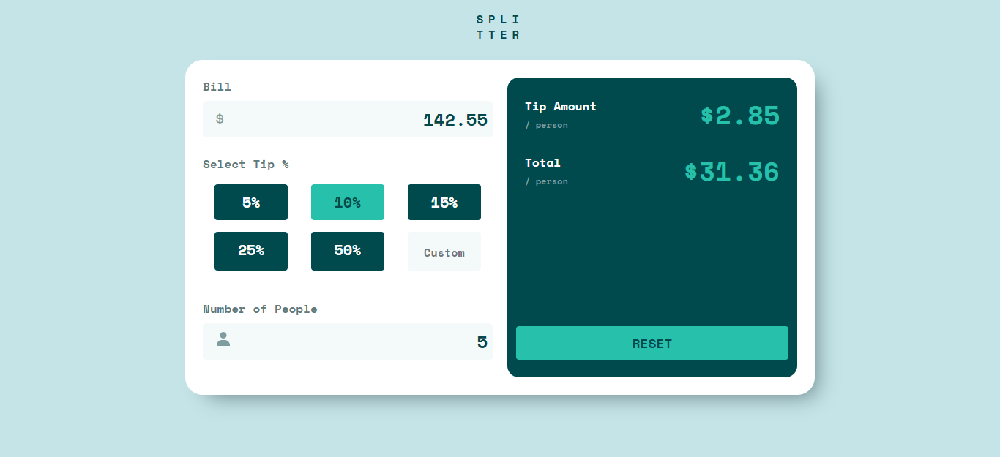

# Frontend Mentor - Tip Calculator 🧔

Este es un challanges de frontend mentor que consiste en un pequeño código que calcule la factura por cliente y monto total.

## Tecnologias Usadas

- **HTML**
- **CSS**
- **VANILLA JS**

## Vistas

## Referencia

- [Challanges Tip Calculator](https://www.frontendmentor.io/challenges/tip-calculator-app-ugJNGbJUX)
- [Code Github]()
- [Website Tip Calculator]()
